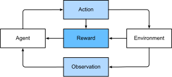

[TOC]

# 1. Introduction 简介

:label:`chap_introduction`

Until recently, nearly every computer program that we interact with daily was coded by software developers from first principles. Say that we wanted to write an application to manage an e-commerce platform. After huddling around a whiteboard for a few hours to ponder the problem, we would come up with the broad strokes of a working solution that might probably look something like this: (i) users interact with the application through an interface running in a web browser or mobile application; (ii) our application interacts with a commercial-grade database engine to keep track of each user's state and maintain records of historical transactions; and (iii) at the heart of our application, the *business logic* (you might say, the *brains*) of our application spells out in methodical detail the appropriate action that our program should take in every conceivable circumstance.

直到最近，我们日常使用的计算机程序都是开发者按照第一法则编写的。假设我们想写一个应用来管理电子商务平台。在白板上花费数小时思考其中的问题后，我们将提出一个可行的解决方案的大致思路，可能看起来像这样：（i）用户通过浏览器或移动应用与应用程序交互；（ii）我们的应用程序与商业级数据库引擎进行交互，以跟踪每个用户的状态并维护历史交易记录；（iii）在我们应用程序的核心，我们的应用程序的 *业务逻辑*（你可能会说 *大脑*）详细的说明了程序在每种可能的情况下应采取的适当措施。

To build the *brains* of our application, we'd have to step through every possible corner case that we anticipate encountering, devising appropriate rules. Each time a customer clicks to add an item to their shopping cart, we add an entry to the shopping cart database table, associating that user's ID with the requested product’s ID. While few developers ever get it completely right the first time (it might take some test runs to work out the kinks), for the most part, we could write such a program from first principles and confidently launch it *before ever seeing a real customer*. Our ability to design automated systems from first principles that drive functioning products and systems, often in novel situations, is a remarkable cognitive feat. And when you are able to devise solutions that work $100\%$ of the time, *you should not be using machine learning*.

为了建造应用程序的 *大脑* ，我们必须逐步解决我们预期会遇到的所有可能的极端情况，并制定适当的规则。每次顾客点击按钮，添加商品到购物车，我们将在数据库中的购物车表中添加一条记录，关联用户ID和相应的商品ID。虽然很少有开发人员第一次就能完全实现它（可能需要一些测试运行才能解决），但在大多数情况下，我们可以从第一法则开始编写这样的程序并*在看到真正的客户之前*放心地启动它。我们在新颖情况下根据第一法则设计自动化系统来驱动产品和系统的能力是一个了不起的认知壮举。如果你可以在给定时间中设计出解决方案，*你无需使用机器学习*。

Fortunately for the growing community of machine learning (ML) scientists, many tasks that we would like to automate do not bend so easily to human ingenuity. Imagine huddling around the whiteboard with the smartest minds you know, but this time you are tackling one of the following problems:

幸运的是，对于不断增长的机器学习（ML）科学家社区努力下，使得许多任务变得自动化，而不用耗费人们太多的努力。想象一下，以你所知道的最聪明的头脑挤在白板上，但是这次你要解决以下问题之一：

* Write a program that predicts tomorrow's weather given geographic information, satellite images, and a trailing window of past weather.
* 编写一个程序，根据地理信息，卫星图像和过去的天气来预测明天天气。
* Write a program that takes in a question, expressed in free-form text, and answers it correctly.
* 编写一个程序，能正确回答任意格式的问题。
* Write a program that given an image can identify all the people it contains, drawing outlines around each.
* 编写一个程序，能通过给定图像识别出其中所有人，并为其绘制轮廓阔。
* Write a program that presents users with products that they are likely to enjoy but unlikely, in the natural course of browsing, to encounter.
* 编写一个程序，向用户展示他们可能喜欢的产品但在正常浏览中不大可能遇到。

In each of these cases, even elite programmers are incapable of coding up solutions from scratch. The reasons for this can vary. Sometimes the program that we are looking for follows a pattern that changes over time, and we need our programs to adapt. In other cases, the relationship (say between pixels, and abstract categories) may be too complicated, requiring thousands or millions of computations that are beyond our conscious understanding (even if our eyes manage the task effortlessly). ML is the study of powerful techniques that can *learn* from *experience*. As ML algorithm accumulates more experience, typically in the form of observational data or interactions with an environment, their performance improves. Contrast this with our deterministic e-commerce platform, which performs according to the same business logic, no matter how much experience accrues, until the developers themselves *learn* and decide that it is time to update the software. In this book, we will teach you the fundamentals of machine learning, and focus in particular on deep learning, a powerful set of techniques driving innovations in areas as diverse as computer vision, natural language processing, healthcare, and genomics.

其中任何一个程序，即使非常优秀的程序员也无法从头开始编写解决方案。其原因可能有所不同。有些，我们正在寻找的程序会随着时间的推移而变化，因此我们需要对程序进行调整。另一些，其中的关系（像像素、抽象类别间的关系）太过于复杂，需要成千上万的计算，这超出了我们的理解（即使是我们的眼睛能毫不不费力地处理的任务）。机器学习是从*经验* 中*学习* 的强有力的工具。随着机器学习算法积累了更多的经验（通常为观测数据和环境交互形式），其性能将会提高。与此形成对比的是，我们的确定的电子商务平台根据相同的业务逻辑运行，无论积累了多少经验，直到开发人员自己*学习*并决定是时候更新软件。本书将教授你机器学习的基础，并主要关注与深度学习。它是一组强大的技术，可以推动计算机视觉，自然语言处理，医疗保健和基因组学等领域的创新。

## 1.1 A Motivating Example 一个令人激动的例子

Before we could begin writing, the authors of this book, like much of the work force, had to become caffeinated. We hopped in the car and started driving. Using an iPhone, Alex called out "Hey Siri", awakening the phone's voice recognition system. Then Mu commanded "directions to Blue Bottle coffee shop". The phone quickly displayed the transcription of his command. It also recognized that we were asking for directions and launched the Maps application to fulfill our request. Once launched, the Maps app identified a number of routes. Next to each route, the phone displayed a predicted transit time. While we fabricated this story for pedagogical convenience, it demonstrates that in the span of just a few seconds, our everyday interactions with a smart phone can engage several machine learning models.

在我们开始写作之前，作者像许多人一样，想要来点咖啡因。 我们坐上车，开车。 Alex使用iPhone喊出“嘿Siri”，唤醒了电话的语音识别系统。 然后，Mu命令道”前往蓝瓶咖啡店的路线”。 电话迅速显示了他的命令的转译。 它还认识到我们正在寻找路线，并启动了“地图”应用程序来满足我们的要求。 启动后，“地图”应用会识别出许多路线。 对于每条路线，手机都会显示预计的花费时间。 尽管我们为了教学上的方便而编造了这个故事，但它表明，在我们与智能手机的日常交互的短短几秒钟内就使用了多种机器学习模型。

Imagine just writing a program to respond to a *wake word* like "Alexa", "Okay, Google" or "Siri". Try coding it up in a room by yourself with nothing but a computer and a code editor, as illustrated in :numref:`fig_wake_word`. How would you write such a program from first principles? Think about it... the problem is hard. Every second, the microphone will collect roughly 44,000 samples. Each sample is a measurement of the amplitude of the sound wave. What rule could map reliably from a snippet of raw audio to confident predictions `{yes, no}` on whether the snippet contains the wake word? If you are stuck, do not worry. We do not know how to write such a program from scratch either. That is why we use ML.

设想一下，写对像"Alexa"，"Okay, Google" 或 "Siri" 这样的*唤醒词* 做出回应的程序。尝试一个人在房间中仅使用一台电脑和文本编辑器编写如下`fig_wake_word`的程序。如何根据第一法则编写这个程序？仔细思考一下，这个问题非常困难。每秒，麦克风可以手机约44,000个样本。测量每个样本声波的振幅。什么规则可以从原始音频准确映射是否含有唤醒词的`{yes, no}`预测？如果你被卡住，不要担心。我们也不知道如何从头开始编写这样的程序。这就是为什么我们使用机器学习


:label:`fig_wake_word`

Here's the trick. Often, even when we do not know how to tell a computer explicitly how to map from inputs to outputs, we are nonetheless capable of performing the cognitive feat ourselves. In other words, even if you do not know *how to program a computer* to recognize the word "Alexa", you yourself *are able* to recognize the word "Alexa". Armed with this ability, we can collect a huge *dataset* containing examples of audio and label those that *do* and that *do not* contain the wake word. In the ML approach, we do not attempt to design a system *explicitly* to recognize wake words. Instead, we define a flexible program whose behavior is determined by a number of *parameters*. Then we use the dataset to determine the best possible set of parameters, those that improve the performance of our program with respect to some measure of performance on the task of interest.

以下就是其中的窍门。通常，即使我们不知道如何明确地告诉计算机如何从输入到输出进行映射，我们仍然有能力自己执行认知专长。换句话说，即使你不知道*如何编写一个程序* 识别“Alexa”这个单词，但你仍*能* 识别出“Alexa”。根据这个能力，我们可以收集一个包含测试音频和是否含有唤醒词的大*数据集*。使用机器学习方法，我们不需要*明确的* 设计出识别唤醒词的系统。相反，我们定义一个灵活的程序，其行为由许多*参数* 决定。然后，我们使用数据集来确定最佳的参数集，这些参数相对于所关注任务的某种性能度量可以提高程序的性能。

You can think of the parameters as knobs that we can turn, manipulating the behavior of the program. Fixing the parameters, we call the program a *model*. The set of all distinct programs (input-output mappings) that we can produce just by manipulating the parameters is called a *family* of models. And the *meta-program* that uses our dataset to choose the parameters is called a *learning algorithm*.

你可以将参数视为可以旋转的旋钮，以控制程序的行为。参数固定后，我们将程序称为模型。我们仅通过操纵参数就可以产生的所有不同程序（输入-输出映射）的集合称为模型的系列。使用数据集选择参数的*元程序* 我们称之为*学习算法* 。 

Before we can go ahead and engage the learning algorithm, we have to define the problem precisely, pinning down the exact nature of the inputs and outputs, and choosing an appropriate model family. In this case, our model receives a snippet of audio as *input*, and it generates a selection among `{yes, no}` as *output*. If all goes according to plan the model's guesses will typically be correct as to whether (or not) the snippet contains the wake word.

在我们继续探索之前学习算法之前，我们需要精确的定义问题，确定输入输出的性质，并选择合适的模型族。在上述情况下，我们的模型接收音频片段作为*输入*，从`{yes, no}` 选择一个作为*输出*。如果一切都正常进行，则该模型能正确的猜测出该片段是否包含唤醒词。

If we choose the right family of models, then there should exist one setting of the knobs such that the model fires `yes` every time it hears the word "Alexa". Because the exact choice of the wake word is arbitrary, we will probably need a model family sufficiently rich that, via another setting of the knobs, it could fire `yes` only upon hearing the word "Apricot". We expect that the same model family should be suitable for *"Alexa" recognition* and *"Apricot" recognition* because they seem, intuitively, to be similar tasks. However, we might need a different family of models entirely if we want to deal with fundamentally different inputs or outputs, say if we wanted to map from images to captions, or from English sentences to Chinese sentences.

如果我们正确的选择了模型族，着应该存在一个旋转设置，以便模型每次听到“Alexa”时触发`yes` 。因为唤醒词的确切选择是任意的，所以我们可能需要一个足够丰富的模型族，以便通过旋钮的另一种设置，只有在听到“Apricot”一词时它才会触发`yea` 。我们期望相同的模型能够识别“Alexa”和“Apricot”，因为直观的看，这是相同的任务。但是，如果我们要处理完全不同的输入或输出，例如，如果我们想从图像到字幕，或者从英语句子到中文句子，我们可能完全需要一个不同的模型族。

As you might guess, if we just set all of the knobs randomly, it is not likely that our model will recognize "Alexa", "Apricot", or any other English word. In deep learning, the *learning* is the process by which we discover the right setting of the knobs coercing the desired behavior from our model.

你可能会猜到，如果我们只是随机的设置旋钮，我们的模型就不太可能识别出“Alexa”和“Apricot”，或任意的英语单词。在深度学习中，*学习* 是一个过程，通过该过程，我们可以从模型中发现实现所需的行为的正确设置旋钮的方式。

As shown in :numref:`fig_ml_loop`, the training process usually looks like this:

训练过程通常入图`fig_ml_loop` 所示：

1. Start off with a randomly initialized model that cannot do anything useful.
1. 从一个随机初始化的模型开始，该模型无法做任何有用的事。
1. Grab some of your labeled data (e.g., audio snippets and corresponding `{yes, no}` labels)
1. 抓取一些已标记的数据（例如，音频片段和对应的`{yes, no}` 标签）
1. Tweak the knobs so the model sucks less with respect to those examples
1. 调整旋钮，以使模型对这些示例中的损失最少
1. Repeat until the model is awesome.
1. 重复，直到模型的效果很棒。


:label:`fig_ml_loop`

To summarize, rather than code up a wake word recognizer, we code up a program that can *learn* to recognize wake words, *if we present it with a large labeled dataset*. You can think of this act of determining a program's behavior by presenting it with a dataset as *programming with data*. We can "program" a cat detector by providing our machine learning system with many examples of cats and dogs, such as the images below:

总之，在*我们展示它大量标记数据集* 后，我们可以编写一个可以*学习* 识别唤醒词的程序而不是编写一个唤醒词识别程序。您可以认为通过将数据集来决定程序的行为，它又被称为*用数据编程* 。我们通过在机器学习系统中提供许多猫和狗的样本，来编写一个猫识别器。样本示例如下：

|cat|cat|dog|dog|
|:---------------:|:---------------:|:---------------:|:---------------:|
|||||

This way the detector will eventually learn to emit a very large positive number if it is a cat, a very large negative number if it is a dog, and something closer to zero if it is not sure, and this barely scratches the surface of what ML can do.

这样，如果它是猫，识别器最终将学会得到一个非常大的正数；如果是狗，它最终将得到一个非常大的负数；如果不确定，它会接近于零，这只是机器学习非常浅显的应用。

Deep learning is just one among many popular methods for solving machine learning problems. Thus far, we have only talked about machine learning broadly and not deep learning. To see why deep learning is important, we should pause for a moment to highlight a couple crucial points.

深度学习只是解决机器学习问题的众多流行方法之一。到目前为止，我们仅广泛地讨论了机器学习，而不是深度学习。为了展示机器学习的重要性，我们先暂停一会儿，学习一些重要的概念。

First, the problems that we have discussed thus far---learning from raw audio signal, the raw pixel values of images, or mapping between sentences of arbitrary lengths and their counterparts in foreign languages---are problems where deep learning excels and where traditional ML methods faltered. Deep models are *deep* in precisely the sense that they learn many *layers* of computation. It turns out that these many-layered (or hierarchical) models are capable of addressing low-level perceptual data in a way that previous tools could not. In bygone days, the crucial part of applying ML to these problems consisted of coming up with manually-engineered ways of transforming the data into some form amenable to *shallow* models. One key advantage of deep learning is that it replaces not only the *shallow* models at the end of traditional learning pipelines, but also the labor-intensive process of feature engineering. Second, by replacing much of the *domain-specific preprocessing*, deep learning has eliminated many of the boundaries that previously separated computer vision, speech recognition, natural language processing, medical informatics, and other application areas, offering a unified set of tools for tackling diverse problems.

首先，看一看我们目前讨论的问题（从原始音频信号、图像原始像素值中学习，将任意长度句子与使用语言相对应）。争对这些问题，深度学习远超过传统机器学习方法。精确的说，深度模型中*深度* 一词的来源是它从许多计算*层* 中学习。事实证明，这些多层次（或分层）模型能够以以前的工具无法解决的方式处理低层感知数据。过去，这些问题使用机器学习关键部分包括提出手动设计的方法，将数据转换为适合*浅层* 模型的形式。深度学习的一个关键优势便是，它不仅可以取代传统学习渠道末尾的*浅层* 模型，还可以取代需要繁重工作的特征工程。第二，通过取代许多*特定领域的预处理*，深度学习打破了分隔计算机视觉、语音识别、自然语言处理、医学信息学和许多其他领域的边界，同时提供了一套统一的工具来解决不同问题。


## 1.2 The Key Components: Data, Models, and Algorithms 关键组件：数据，模型和算法

In our *wake-word* example, we described a dataset consisting of audio snippets and binary labels gave a hand-wavy sense of how we might *train* a model to approximate a mapping from snippets to classifications. This sort of problem, where we try to predict a designated unknown *label* given known *inputs*, given a dataset consisting of examples, for which the labels are known is called *supervised learning*, and it is just one among many *kinds* of machine learning problems. In the next section, we will take a deep dive into the different ML problems. First, we'd like to shed more light on some core components that will follow us around, no matter what kind of ML problem we take on:

在我们*唤醒词* 的示例中，我们描述了一个由音频片段和二元标签组成的数据集，使我们对如何*训练* 模型来近似从片段到分类的映射有了一种基本的感觉。这种问题，在给定已知*输入* 的情况下，我们尝试预测指定的未知*标签*，给定一个由样本组成的数据集，其中已知样本标签的情况称为*有监督学习*，这只是机器学习众多种类中的一类。在下一节中，我们将深入探讨不同的机器学习问题。首先，无论我们遇到哪种机器学习问题，我们都需要更多地了解一些核心组件：

1. The *data* that we can learn from.
2. 我们可以用来学习的*数据* 。
3. A *model* of how to transform the data.
4. 一个转换数据的*模型* 。
5. A *loss* function that quantifies the *badness* of our model.
6. 一个*损失* 函数来量化模型的*缺陷* 。
7. An *algorithm* to adjust the model's parameters to minimize the loss.
8. 一个用来修改模型参数最小化*损失* 的算法。


### 1.2.1 Data 数据

It might go without saying that you cannot do data science without data. We could lose hundreds of pages pondering what precisely constitutes data, but for now we will err on the practical side and focus on the key properties to be concerned with. Generally we are concerned with a collection of *examples* (also called *data points*, *samples*, or *instances*). In order to work with data usefully, we typically need to come up with a suitable numerical representation. Each *example* typically consists of a collection of numerical attributes called *features*. In the supervised learning problems above, a special feature is designated as the prediction *target*, (sometimes called the *label* or *dependent variable*). The given features from which the model must make its predictions can then simply be called the *features*, (or often, the *inputs*, *covariates*, or *independent variables*).

不用说，没有数据你无法进行数据科学。我们可能会浪费数百页来仔细考虑数据的确切构成，但将会在实际应用上犯错，并专注于要关注的关键属性。一般来说，我们关心一组*示例*（或称*数据点，样本，或实例* ）集。为了合理的利用数据，我们需要提出一个合适的数字表示。每一个*示例* 一般主要由称为*特征* 的数字属性集。在上述的监督学习问题中，一个指定特别的特征，被作为预测的*目标*（有时又称为*标签* 或*因变量* ）。然后，可以将模型必须根据其进行预测的给定特征简单地称为*特征*（或通常称为*输入*，*协变量*或*独立变量* ）。

If we were working with image data, each individual photograph might constitute an *example*, each represented by an ordered list of numerical values corresponding to the brightness of each pixel. A $200\times 200$ color photograph would consist of $200\times200\times3=120000$ numerical values, corresponding to the brightness of the red, green, and blue channels for each spatial location. In a more traditional task, we might try to predict whether or not a patient will survive, given a standard set of features such as age, vital signs, diagnoses, etc.

如果我们使用图像数据，则每张照片可能会构成一个*样本*，每张照片都由每个像素的亮度相对应的数字值的有序列表表示。一个 $200\times 200$ 的彩色图片由 $200\times200\times3=120000$ 个数组成，分别对应每个位置的红色，绿色和蓝色通道的亮度。在很多传统的任务中，我们常根据患者的年龄、生命体征、诊断信息等特征来预测患者的存活概率。

When every example is characterized by the same number of numerical values, we say that the data consists of *fixed-length* vectors and we describe the (constant) length of the vectors as the *dimensionality* of the data. As you might imagine, fixed length can be a convenient property. If we wanted to train a model to recognize cancer in microscopy images, fixed-length inputs means we have one less thing to worry about.

当每个样本都使用相同数量的数字来表示后，我们称之为定长的矢量，将矢量的长度称为数据的*维度*。你可能想到，定长是一个很好的性质。如果我们想训练一个从显微镜图像中识别癌症的模型，则定长输入意味着我们不必担心一件事。

However, not all data can easily be represented as fixed length vectors. While we might expect microscope images to come from standard equipment, we cannot expect images mined from the Internet to all show up with the same resolution or shape. For images, we might consider cropping them all to a standard size, but that strategy only gets us so far. We risk losing information in the cropped out portions. Moreover, text data resists fixed-length representations even more stubbornly. Consider the customer reviews left on e-commerce sites like Amazon, IMDB, or TripAdvisor. Some are short: "it stinks!". Others ramble for pages. One major advantage of deep learning over traditional methods is the comparative grace with which modern models can handle *varying-length* data.

然而，并不是所有数据都可以使用定长矢量来表示。虽然我们可能希望显微镜图像来自标准设备，但我们不能期望从互联网上采集的图像都能以相同的分辨率或形状显示。对于图像，我们或许可以考虑裁剪它们到同一尺寸，但是这种策略仅能使我们走到现在。我们可能会因裁剪损失部分信息。此外，文本数据甚至更难使用定长表示。像顾客在亚马逊、IMDB或TripAdvisor这种电子商务网站的评论。有些很短，如“it stinks!”。其他人则只是随便看看。深度学习相对于传统方法的一个主要的优势便是这个现代模型可以优雅的处理*可变长度* 数据。

Generally, the more data we have, the easier our job becomes. When we have more data, we can train more powerful models, and rely less heavily on pre-conceived assumptions. The regime change from (comparatively small) to big data is a major contributor to the success of modern deep learning. To drive the point home, many of the most exciting models in deep learning do not work without large datasets. Some others work in the low-data regime, but are no better than traditional approaches.

一般来说，数据越多，工作越容易。当我们有更多数据后，我们可以训练更多有用的模型，并减少了对预想假设的依赖。从（相对较小的数据集）到大数据的体制转变是现代深度学习成功的主要推动力。如果没有大型数据集，深度学习中许多最令人激动的模型就无法工作。在小数据集上的效果，深度学习并不比传统方法好。

Finally it is not enough to have lots of data and to process it cleverly. We need the *right* data. If the data is full of mistakes, or if the chosen features are not predictive of the target quantity of interest, learning is going to fail. The situation is captured well by the cliché: *garbage in, garbage out*. Moreover, poor predictive performance is not the only potential consequence. In sensitive applications of machine learning, like predictive policing, resumé screening, and risk models used for lending, we must be especially alert to the consequences of garbage data. One common failure mode occurs in datasets where some groups of people are unrepresented in the training data. Imagine applying a skin cancer recognition system in the wild that had never seen black skin before. Failure can also occur when the data does not merely under-represent some groups, but reflects societal prejudices. For example if past hiring decisions are used to train a predictive model that will be used to screen resumes, then machine learning models could inadvertently capture and automate historical injustices. Note that this can all happen without the data scientist actively conspiring, or even being aware.

有许多数据并正确的处理它是不够的。我们需要*正确的* 数据。如果数据充满错误或或者所选特征不能预测目标，学习将失败。这就是典型的*无用输入，无用输出* 的情况。而且低预测性能不是唯一的潜在后果。机器学习在一些敏感场景的应用，例如预测性治安状况，简历筛选以及用于贷款的风险模型，我们必须特别警惕垃圾数据带来的后果。一个常见的失败模型，就发生在训练数据集包含无意义的数据。试想一下，如果一个皮肤癌识别系统在使用之前从未见过黑色皮肤。当数据不仅无法代表某些群体，而且反映出社会偏见时，也会带来失败。例如，使用通过招聘的简历来训练预测模型，那么机器学习模型可能会无意间捕获并自动带来偏见。请注意，这一切都可能在没有数据科学家积极合作或在毫无感觉的情况下发生。


### 1.2.2 Models 模型

Most machine learning involves *transforming* the data in some sense. We might want to build a system that ingests photos and predicts *smiley-ness*. Alternatively, we might want to ingest a set of sensor readings and predict how *normal* vs *anomalous* the readings are. By *model*, we denote the computational machinery for ingesting data of one type, and spitting out predictions of a possibly different type. In particular, we are interested in statistical models that can be estimated from data. While simple models are perfectly capable of addressing appropriately simple problems the problems that we focus on in this book stretch the limits of classical methods. Deep learning is differentiated from classical approaches principally by the set of powerful models that it focuses on. These models consist of many successive transformations of the data that are chained together top to bottom, thus the name *deep learning*. On our way to discussing deep neural networks, we will discuss some more traditional methods.

大多数机器学习都在某种意义上涉及*转换* 数据。我们有时可能想通过照片来预测是否是*笑脸*。或者，我们有时希望以一组传感器读数，并预测读数的*正常* 与*异常* 状态。通过*模型*，我们使计算机系统从一种类型的输入数据得到不同类型的预测。特别的，我们对可能对数据估算的统计模型感兴趣。虽然简单的模型完全能够解决适当的简单问题，但我们在本书中关注的问题却扩展了经典方法的局限性。深度学习与经典方法的区别主要是关注的一组强大模型。这些模型由数据的许多连续变换组成，这些变换从上到下链接在一起，因此得名*深度学习*。在讨论深度神经网络的方式上，我们将讨论一些更传统的方法。


###  1.2.3 Objective functions 目标函数

Earlier, we introduced machine learning as "learning from experience". By *learning* here, we mean *improving* at some task over time. But who is to say what constitutes an improvement? You might imagine that we could propose to update our model, and some people might disagree on whether the proposed update constituted an improvement or a decline.

前文中，我们已经将机器学习表述为*从经验中学习*。这里的*学习* 指的是在某些任务随着时间的*改进*。但是什么构成了进步呢？你可能会想到我们可以提议更新模型，而有些人可能对提议的更新是改善还是减少持不同意见。

In order to develop a formal mathematical system of learning machines, we need to have formal measures of how good (or bad) our models are. In machine learning, and optimization more generally, we call these objective functions. By convention, we usually define objective functions so that *lower* is *better*. This is merely a convention. You can take any function $f$ for which higher is better, and turn it into a new function $f'$ that is qualitatively identical but for which lower is better by setting $f' = -f$. Because lower is better, these functions are sometimes called *loss functions* or *cost functions*.

为了开发机器学习的数字系统，我们需要对模型的好坏有一个统一的度量。在机器学习和更广泛的优化中，我们称这些目标函数。一般来说我们希望目标函数*越低越好*。同样，你也可以认为函数 $f$ 越高越好，然后通过设置$f' = -f$ 将其转换为质量上相同但较低的更好的新函数$ f'$。正因为越低越好，这个函数有时被称为*损失函数*。

When trying to predict numerical values, the most common objective function is squared error $(y-\hat{y})^2$. For classification, the most common objective is to minimize error rate, i.e., the fraction of instances on which our predictions disagree with the ground truth. Some objectives (like squared error) are easy to optimize. Others (like error rate) are difficult to optimize directly, owing to non-differentiability or other complications. In these cases, it is common to optimize a *surrogate objective*.

在预测数字值时，最常用的目标函数便是平方误差$(y-\hat{y})^2$。对于分类，最常见的目标函数是最小化错误率，即我们的预测与基本事实不一致的样本所占的比例。一些目标函数（如平方误差）很容易优化。其他的目标函数（如错误率）由于不可微或其他复杂性而难以直接优化。在这些情况下，常使用*替代目标* 来优化。

Typically, the loss function is defined with respect to the model's parameters and depends upon the dataset. The best values of our model's parameters are learned by minimizing the loss incurred on a *training set* consisting of some number of *examples* collected for training. However, doing well on the training data does not guarantee that we will do well on (unseen) test data. So we will typically want to split the available data into two partitions: the training data (for fitting model parameters) and the test data (which is held out for evaluation), reporting the following two quantities:

通常，损失函数是根据模型的参数定义的，并取决于数据集。通过最小化*训练集* 所造成的损失来学习模型参数的最佳值，该*训练集* 包含一些为训练而收集的*示例*。然而，在训练数据上的表现并不能保证我们会在（未知的）测试数据上做得很好。所以，我们一般将可用的数据分为两部分：训练数据（用于拟合模型参数）和测试数据（用于评估），使用这两部分表示：

 * **Training Error:** The error on that data on which the model was trained. You could think of this as being like a student's scores on practice exams used to prepare for some real exam. Even if the results are encouraging, that does not guarantee success on the final exam.
 * 训练误差：训练模型在数据上的误差。你可以认为这个就像学生在用于准备一些真实的考试时测试考试中的得分。即使即使在测试考试中表现不错，但并不意味着这可以作为最终考试是否成功的依据。
 * **Test Error:** This is the error incurred on an unseen test set. This can deviate significantly from the training error. When a model performs well on the training data but fails to generalize to unseen data, we say that it is *overfitting*. In real-life terms, this is like flunking the real exam despite doing well on practice exams.
 * 测试误差：这是在未知的测试集上发生的错误。这可能与训练误差完全不同。当一个模型在训练数据集上表现的很好，但在未知数据上的表现不好，我们称之为*过拟合*。 从现实生活的角度来看，这就像在测试考试中表现很好，却在正式考试中不及格。


### 1.2.4 Optimization algorithms 优化算法

Once we have got some data source and representation, a model, and a well-defined objective function, we need an algorithm capable of searching for the best possible parameters for minimizing the loss function. The most popular optimization algorithms for neural networks follow an approach called gradient descent. In short, at each step, they check to see, for each parameter, which way the training set loss would move if you perturbed that parameter just a small amount. They then update the parameter in the direction that reduces the loss.

当我们有原始数据和它们转化后的表示，训练模型和不错的目标函数，我们需要一个学习算法，它能搜索到最大可能损失函数的参数。在神经网络中，最为常有的算法便是梯度下降。这种方法简而言之，就是在每个步骤中，检查每个参数，如果仅对参数进行微小改变，训练集损失会像那个方向移动。接着，沿这减少损失的方向更新参数。


## 1.3 Kinds of Machine Learning 机器学习种类

In the following sections, we discuss a few *kinds* of machine learning problems in greater detail. We begin with a list of *objectives*, i.e., a list of things that we would like machine learning to do. Note that the objectives are complemented with a set of techniques of *how* to accomplish them, including types of data, models, training techniques, etc. The list below is just a sampling of the problems ML can tackle to motivate the reader and provide us with some common language for when we talk about more problems throughout the book.

在以下各节中，我们将更详细地讨论几种机器学习问题。我们从*目标* 开始，即我们想让机器学习所做的事。注意，目标包括一系列*如何* 实现它所需要的技术，包括数据类型，模型，训练技术等。下面的列表只是ML可以解决的一些问题示例，这些示例可以激发读者并为我们在本书中讨论更多问题时提供一些通用样本。

### Supervised learning 监督学习

Supervised learning addresses the task of predicting *targets* given *inputs*. The targets, which we often call *labels*, are generally denoted by *y*. The input data, also called the *features* or covariates, are typically denoted $\mathbf{x}$. Each (input, target) pair is called an *examples* or an *instances*. Some times, when the context is clear, we may use the term examples, to refer to a collection of inputs, even when the corresponding targets are unknown. We denote any particular instance with a subscript, typically $i$, for instance ($\mathbf{x}*i, y_i$). A dataset is a collection of $n$ instances  $\{\mathbf{x}_i, y_i\}_{i=1}^n$. Our goal is to produce a model $f_\theta$ that maps any input $\mathbf{x}_i$ to a prediction $f_{\theta}(\mathbf{x}_i)$.

监督学习解决了在根据给定*输入* 的情况下预测*目标* 的任务。这个目标，我们通常称之为*标签*，常用 *y* 表示。输入数据， 又称为*特征* 或协变量，使用 $\mathbf{x}$ 表示。每一对（输入，目标）称为*样本* 或*实例*。有时，在表述清晰时，我们使用样本来表示输入集，即使这时对应的目标并不清楚。我们常用下标 $i$ 来表示任意一个特定的实例，例如 ($\mathbf{x}*i, y_i$)。一个数据集是 $n$ 个实例的集合 $\{\mathbf{x}_i, y_i\}_{i=1}^n$。我们的目标是得到一个 $f_\theta$ 的模型，可以对任何输入 $\mathbf{x}_i$ 得到一个预测 $f_{\theta}(\mathbf{x}_i)$。

To ground this description in a concrete example, if we were working in healthcare, then we might want to predict whether or not a patient would have a heart attack. This observation, *heart attack* or *no heart attack*, would be our label $y$. The input data $\mathbf{x}$ might be vital signs such as heart rate, diastolic and systolic blood pressure, etc.

以一个具体例子为例，如果我们关注于医疗，那么我们可能想预测一个病人是否有心脏病。显然，*有心脏病* 或*没有心脏病*，就是我们的标签 $y$。输入数据 $\mathbf{x}$ 可能是像心率、舒张压和收缩压等这样的生命体征。

The supervision comes into play because for choosing the parameters $\theta$, we (the supervisors) provide the model with a dataset consisting of *labeled examples* ($\mathbf{x}_i, y_i$), where each example $\mathbf{x}_i$ is matched with the correct label.

监督因参数 $\theta$ 的选择起作用，我们（监督者）为模型提供了由*带标签的示例* ($\mathbf{x}_i, y_i$) 组成的数据集，其中每个示例  $\mathbf{x}_i$ 与正确的标签匹配。

In probabilistic terms, we typically are interested in estimating the conditional probability $P(y|x)$. While it is just one among several paradigms within machine learning, supervised learning accounts for the majority of successful applications of machine learning in industry. Partly, that is because many important tasks can be described crisply as estimating the probability of something unknown given a particular set of available data:

在概率论中，我们一般对条件概率 $P(y|x)$ 感兴趣。以下是机器学习中监督学习在生产中的一些成功应用。这在一定程度上是因为，许多重要的任务可以简单地描述为：在给定一组特定的可用数据的情况下，对未知事件的概率进行估计:

* Predict cancer vs not cancer, given a CT image.
* 根据CT图预测是否患癌.
* Predict the correct translation in French, given a sentence in English.
* 根据英文句子预测正确的法文翻译。
* Predict the price of a stock next month based on this month's financial reporting data.
* 根据本月金融数据预测下月股票价格。

Even with the simple description "predict targets from inputs" supervised learning can take a great many forms and require a great many modeling decisions, depending on (among other considerations) the type, size, and the number of inputs and outputs. For example, we use different models to process sequences (like strings of text or time series data) and for processing fixed-length vector representations. We will visit many of these problems in depth throughout the first 9 parts of this book.

即使使用简单的描述为*根据输入预测目标*，监督学习也可以采用多种形式，并且需要进行大量的建模决策，这取决于（除其他因素外）输入，输出的类型，大小以及数量。例如，我么使用不同的模型处理像文本字符串或时间序列数据这样的序列，并使用定长的矢量来表示。在本书的前9章我们会深入探讨许多这种类似的问题。

Informally, the learning process looks something like this: Grab a big collection of examples for which the covariates are known and select from them a random subset, acquiring the ground truth labels for each. Sometimes these labels might be available data that has already been collected (e.g., did a patient die within the following year?) and other times we might need to employ human annotators to label the data, (e.g., assigning images to categories).

通俗的说，学习过程就像这样：选取大量已知协变量的样本集，并从中随机选取子集，来获得对应的标签。有时这些标签可能是已经收集到（例如，病人是否在一年内死亡？）但有时我们可能需要雇佣人来对数据进行标记，（例如，将图像分类）。

Together, these inputs and corresponding labels comprise the training set. We feed the training dataset into a supervised learning algorithm, a function that takes as input a dataset and outputs another function, *the learned model*. Finally, we can feed previously unseen inputs to the learned model, using its outputs as predictions of the corresponding label. The full process in drawn in :numref:`fig_supervised_learning`.

这些输入和对应的标签构成了训练集。我们将训练数据集输入到监督学习算法中，该函数将数据集作为输入并输出另一个函数，即*学习模型*。最后，我们可以将先前未见过的输入提供给学习的模型，并将其输出用作相应标签的预测。处理过程如图。


:label:`fig_supervised_learning`


#### Regression 回归

Perhaps the simplest supervised learning task to wrap your head around is *regression*. Consider, for example a set of data harvested from a database of home sales. We might construct a table, where each row corresponds to a different house, and each column corresponds to some relevant attribute, such as the square footage of a house, the number of bedrooms, the number of bathrooms, and the number of minutes (walking) to the center of town. In this dataset each *example* would be a specific house, and the corresponding *feature vector* would be one row in the table.

可能最简单的监督学习任务就是*回归*。例如，考虑从房屋销售数据库中收集的一组数据。这可能是一张表，其中每一行表示对应不同的房子，每一列对应相关属性，例如房屋的面积、卧室数、浴室数、走到市中心的时间（单位：分钟）。在此数据集中，每个*样本* 是一栋特定的房子，而对应的*属性矩阵* 将是表中的一行。

If you live in New York or San Francisco, and you are not the CEO of Amazon, Google, Microsoft, or Facebook, the (sq. footage, no. of bedrooms, no. of bathrooms, walking distance) feature vector for your home might look something like: $[100, 0, .5, 60]$. However, if you live in Pittsburgh, it might look more like $[3000, 4, 3, 10]$. Feature vectors like this are essential for most classic machine learning algorithms. We will continue to denote the feature vector correspond to any example $i$ as $\mathbf{x}_i$ and we can compactly refer to the full table containing all of the feature vectors as $X$.

如果你居住在纽约和旧金山，并且不是亚马逊、谷歌、微软或脸谱的CEO，那么（房屋的面积【英尺】、卧室数、浴室数、步行距离）的属性矩阵你或许可以看成这样：$[100, 0, .5, 60]$。然而，如果你居住在匹兹堡，属性矩阵或许是这样 $[3000, 4, 3, 10]$。像这样的特征向量对于大多数经典的机器学习算法来说都是必不可少的。我们使用 $\mathbf{x}_i$ 来表示样本 $i$ 对应的属性矩阵，我们可以将包含所有特征向量的完整表简洁的表示为 $X$。

What makes a problem a *regression* is actually the outputs. Say that you are in the market for a new home. You might want to estimate the fair market value of a house, given some features like these. The target value, the price of sale, is a *real number*. If you remember the formal definition of the reals you might be scratching your head now. Homes probably never sell for fractions of a cent, let alone prices expressed as irrational numbers. In cases like this, when the target is actually discrete, but where the rounding takes place on a sufficiently fine scale, we will abuse language just a bit and continue to describe our outputs and targets as real-valued numbers.

导致*回归* 问题的实际上是输出。假设你正在寻找新家。因此，你能需要估算房屋的真实市场价。售价就是目标值，它是一个*实数*。如果您还记得关于实数的定义，那么你现在可能会迷惑。房屋可能永远不会以不到一分钱的价格出售，更不用说以不合理数字表示的价格了。在这个情况下，当目标实际上是离散的，但能在足够小的范围内进行舍入时，我们将稍微滥用语言，并继续将输出和目标描述为实数值。

We denote any individual target $y_i$ (corresponding to example $\mathbf{x}_i$) and the set of all targets $\mathbf{y}$ (corresponding to all examples $X$). When our targets take on arbitrary values in some range, we call this a regression problem. Our goal is to produce a model whose predictions closely approximate the actual target values. We denote the predicted target for any instance $\hat{y}_i$. Do not worry if the notation is bogging you down. We will unpack it more thoroughly in the subsequent chapters.

我们使用 $y_i$ 来表示任意一个目标（对应样本 $\mathbf{x}_i$），所有目标的集合使用 $\mathbf{y}$ 表示（对应样本 $X$）。当目标可以使用某个区间的任意值时，我们称之为回归问题。我们的目标值便是得到与真实值的相近的估计值。我们使用 $\hat{y}_i$表示任何样本的预测目标。不必对这些符号感到困惑，我们将在随后的章节中深入介绍。

Lots of practical problems are well-described regression problems. Predicting the rating that a user will assign to a movie can be thought of as a regression problem and if you designed a great algorithm to accomplish this feat in 2009, you might have won the [1-million-dollar Netflix prize](https://en.wikipedia.org/wiki/Netflix_Prize). Predicting the length of stay for patients in the hospital is also a regression problem. A good rule of thumb is that any *How much?* or *How many?* problem should suggest regression.

* "How many hours will this surgery take?": *regression*
* "How many dogs are in this photo?": *regression*.

However, if you can easily pose your problem as "Is this a _ ?", then it is likely, classification, a different kind of supervised problem that we will cover next. Even if you have never worked with machine learning before, you have probably worked through a regression problem informally. Imagine, for example, that you had your drains repaired and that your contractor spent $x_1=3$ hours removing gunk from your sewage pipes. Then she sent you a bill of $y_1 = $350$. Now imagine that your friend hired the same contractor for $x_2 = 2$ hours and that she received a bill of $y_2 = $250$. If someone then asked you how much to expect on their upcoming gunk-removal invoice you might make some reasonable assumptions, such as more hours worked costs more dollars. You might also assume that there is some base charge and that the contractor then charges per hour. If these assumptions held true, then given these two data points, you could already identify the contractor's pricing structure: $100 per hour plus $50 to show up at your house. If you followed that much then you already understand the high-level idea behind linear regression (and you just implicitly designed a linear model with a bias term).

In this case, we could produce the parameters that exactly matched the contractor's prices. Sometimes that is not possible, e.g., if some of the variance owes to some factors besides your two features. In these cases, we will try to learn models that minimize the distance between our predictions and the observed values. In most of our chapters, we will focus on one of two very common losses, the [L1 loss](http://mxnet.incubator.apache.org/api/python/gluon/loss.html#mxnet.gluon.loss.L1Loss) where

$$l(y, y') = \sum_i |y_i-y_i'|$$

and the least mean squares loss, or[L2 loss](http://mxnet.incubator.apache.org/api/python/gluon/loss.html#mxnet.gluon.loss.L2Loss),where

$$l(y, y') = \sum_i (y_i - y_i')^2.$$

As we will see later, the $L_2$ loss corresponds to the assumption that our data was corrupted by Gaussian noise, whereas the $L_1$ loss corresponds to an assumption of noise from a Laplace distribution.

#### Classification 分类

While regression models are great for addressing *how many?* questions,
lots of problems do not bend comfortably to this template.
For example, a bank wants to add check scanning to their mobile app.
This would involve the customer snapping a photo of a check
with their smart phone's camera
and the machine learning model would need to be able
to automatically understand text seen in the image.
It would also need to understand hand-written text to be even more robust.
This kind of system is referred to as optical character recognition (OCR),
and the kind of problem it addresses is called *classification*.
It is treated with a different set of algorithms
than those used for regression (although many techniques will carry over).

In classification, we want our model to look at a feature vector,
e.g., the pixel values in an image,
and then predict which category (formally called *classes*),
among some (discrete) set of options, an example belongs.
For hand-written digits, we might have 10 classes,
corresponding to the digits 0 through 9.
The simplest form of classification is when there are only two classes,
a problem which we call binary classification.
For example, our dataset $X$ could consist of images of animals
and our *labels* $Y$ might be the classes $\mathrm{\{cat, dog\}}$.
While in regression, we sought a *regressor* to output a real value $\hat{y}$,
in classification, we seek a *classifier*, whose output $\hat{y}$ is the predicted class assignment.

For reasons that we will get into as the book gets more technical,
it can be hard to optimize a model that can only output
a hard categorical assignment, e.g., either *cat* or *dog*.
In these cases, it is usually much easier to instead express
our model in the language of probabilities.
Given an example $x$, our model assigns a probability $\hat{y}_k$
to each label $k$. Because these are probabilities,
they need to be positive numbers and add up to $1$
and thus we only need $K-1$ numbers
to assign probabilities of $K$ categories.
This is easy to see for binary classification.
If there is a $0.6$ ($60\%$) probability that an unfair coin comes up heads,
then there is a $0.4$ ($40\%$) probability that it comes up tails.
Returning to our animal classification example,
a classifier might see an image and output the probability
that the image is a cat $P(y=\text{cat} \mid x) = 0.9$.
We can interpret this number by saying that the classifier
is $90\%$ sure that the image depicts a cat.
The magnitude of the probability for the predicted class
conveys one notion of uncertainty.
It is not the only notion of uncertainty
and we will discuss others in more advanced chapters.

When we have more than two possible classes,
we call the problem *multiclass classification*.
Common examples include hand-written character recognition
`[0, 1, 2, 3 ... 9, a, b, c, ...]`.
While we attacked regression problems by trying
to minimize the L1 or L2 loss functions,
the common loss function for classification problems is called cross-entropy.
In MXNet Gluon, the corresponding loss function can be found [here](https://mxnet.incubator.apache.org/api/python/gluon/loss.html#mxnet.gluon.loss.SoftmaxCrossEntropyLoss).

Note that the most likely class is not necessarily
the one that you are going to use for your decision.
Assume that you find this beautiful mushroom in your backyard
as shown in :numref:`fig_death_cap`.


:width:`200px`
:label:`fig_death_cap`

Now, assume that you built a classifier and trained it
to predict if a mushroom is poisonous based on a photograph.
Say our poison-detection classifier outputs
$P(y=\mathrm{death cap}|\mathrm{image}) = 0.2$.
In other words, the classifier is $80\%$ sure
that our mushroom *is not* a death cap.
Still, you'd have to be a fool to eat it.
That is because the certain benefit of a delicious dinner
is not worth a $20\%$ risk of dying from it.
In other words, the effect of the *uncertain risk*
outweighs the benefit by far. We can look at this more formally.
Basically, we need to compute the expected risk that we incur,
i.e., we need to multiply the probability of the outcome
with the benefit (or harm) associated with it:

$$L(\mathrm{action}| x) = E_{y \sim p(y| x)}[\mathrm{loss}(\mathrm{action},y)].$$

Hence, the loss $L$ incurred by eating the mushroom
is $L(a=\mathrm{eat}| x) = 0.2 * \infty + 0.8 * 0 = \infty$,
whereas the cost of discarding it is
$L(a=\mathrm{discard}| x) = 0.2 * 0 + 0.8 * 1 = 0.8$.

Our caution was justified: as any mycologist would tell us,
the above mushroom actually *is* a death cap.
Classification can get much more complicated than just
binary, multiclass, or even multi-label classification.
For instance, there are some variants of classification
for addressing hierarchies.
Hierarchies assume that there exist some relationships among the many classes.
So not all errors are equal---if we must err, we would prefer
to misclassify to a related class rather than to a distant class.
Usually, this is referred to as *hierarchical classification*.
One early example is due to [Linnaeus](https://en.wikipedia.org/wiki/Carl_Linnaeus), who organized the animals in a hierarchy.

In the case of animal classification,
it might not be so bad to mistake a poodle for a schnauzer,
but our model would pay a huge penalty
if it confused a poodle for a dinosaur.
Which hierarchy is relevant might depend
on how you plan to use the model.
For example, rattle snakes and garter snakes
might be close on the phylogenetic tree,
but mistaking a rattler for a garter could be deadly.

#### Tagging

Some classification problems do not fit neatly
into the binary or multiclass classification setups.
For example, we could train a normal binary classifier
to distinguish cats from dogs.
Given the current state of computer vision,
we can do this easily, with off-the-shelf tools.
Nonetheless, no matter how accurate our model gets,
we might find ourselves in trouble when the classifier
encounters an image of the Town Musicians of Bremen.


:width:`300px`


As you can see, there is a cat in the picture,
and a rooster, a dog, a donkey and a bird,
with some trees in the background.
Depending on what we want to do with our model
ultimately, treating this as a binary classification problem
might not make a lot of sense.
Instead, we might want to give the model the option of
saying the image depicts a cat *and* a dog *and* a donkey
*and* a rooster *and* a bird.

The problem of learning to predict classes that are
*not mutually exclusive* is called multi-label classification.
Auto-tagging problems are typically best described
as multi-label classification problems.
Think of the tags people might apply to posts on a tech blog,
e.g., "machine learning", "technology", "gadgets",
"programming languages", "linux", "cloud computing", "AWS".
A typical article might have 5-10 tags applied
because these concepts are correlated.
Posts about "cloud computing" are likely to mention "AWS"
and posts about "machine learning" could also deal
with "programming languages".

We also have to deal with this kind of problem when dealing
with the biomedical literature, where correctly tagging articles is important
because it allows researchers to do exhaustive reviews of the literature.
At the National Library of Medicine, a number of professional annotators
go over each article that gets indexed in PubMed
to associate it with the relevant terms from MeSH,
a collection of roughly 28k tags.
This is a time-consuming process and the
annotators typically have a one year lag between archiving and tagging.
Machine learning can be used here to provide provisional tags
until each article can have a proper manual review.
Indeed, for several years, the BioASQ organization
has [hosted a competition](http://bioasq.org/) to do precisely this.


#### Search and ranking

Sometimes we do not just want to assign each example to a bucket
or to a real value. In the field of information retrieval,
we want to impose a ranking on a set of items.
Take web search for example, the goal is less to determine whether
a particular page is relevant for a query, but rather,
which one of the plethora of search results is *most relevant*
for a particular user.
We really care about the ordering of the relevant search results
and our learning algorithm needs to produce ordered subsets
of elements from a larger set.
In other words, if we are asked to produce the first 5 letters from the alphabet, there is a difference
between returning ``A B C D E`` and ``C A B E D``.
Even if the result set is the same,
the ordering within the set matters.

One possible solution to this problem is to first assign
to every element in the set a corresponding relevance score
and then to retrieve the top-rated elements.
[PageRank](https://en.wikipedia.org/wiki/PageRank),
the original secret sauce behind the Google search engine
was an early example of such a scoring system but it was
peculiar in that it did not depend on the actual query.
Here they relied on a simple relevance filter
to identify the set of relevant items
and then on PageRank to order those results
that contained the query term.
Nowadays, search engines use machine learning and behavioral models
to obtain query-dependent relevance scores.
There are entire academic conferences devoted to this subject.


#### Recommender systems
:label:`subsec_recommender_systems`

Recommender systems are another problem setting
that is related to search and ranking.
The problems are similar insofar as the goal
is to display a set of relevant items to the user.
The main difference is the emphasis on *personalization*
to specific users in the context of recommender systems.
For instance, for movie recommendations,
the results page for a SciFi fan and the results page
for a connoisseur of Peter Sellers comedies might differ significantly.
Similar problems pop up in other recommendation settings,
e.g., for retail products, music, or news recommendation.

In some cases, customers provide explicit feedback communicating
how much they liked a particular product
(e.g., the product ratings and reviews on Amazon, IMDB, GoodReads, etc.).
In some other cases, they provide implicit feedback,
e.g., by skipping titles on a playlist,
which might indicate dissatisfaction but might just indicate
that the song was inappropriate in context.
In the simplest formulations, these systems are trained
to estimate some score $y_{ij}$, such as an estimated rating
or the probability of purchase, given a user $u_i$ and product $p_j$.

Given such a model, then for any given user,
we could retrieve the set of objects with the largest scores $y_{ij}$,
which could then be recommended to the customer.
Production systems are considerably more advanced and take
detailed user activity and item characteristics into account
when computing such scores. :numref:`fig_deeplearning_amazon` is an example
of deep learning books recommended by Amazon based on personalization algorithms tuned to capture the author's preferences.


:label:`fig_deeplearning_amazon`

Despite their tremendous economic value, recommendation systems
naively built on top of predictive models
suffer some serious conceptual flaws.
To start, we only observe *censored feedback*.
Users preferentially rate movies that they feel strongly about:
you might notice that items receive many 5 and 1 star ratings
but that there are conspicuously few 3-star ratings.
Moreover, current purchase habits are often a result
of the recommendation algorithm currently in place,
but learning algorithms do not always take this detail into account.
Thus it is possible for feedback loops to form
where a recommender system preferentially pushes an item
that is then taken to be better (due to greater purchases)
and in turn is recommended even more frequently.
Many of these problems about how to deal with censoring,
incentives, and feedback loops, are important open research questions.

#### Sequence Learning

So far, we have looked at problems where we have
some fixed number of inputs and produce a fixed number of outputs.
Before we considered predicting home prices from a fixed set of features: square footage, number of bedrooms,
number of bathrooms, walking time to downtown.
We also discussed mapping from an image (of fixed dimension)
to the predicted probabilities that it belongs to each
of a fixed number of classes, or taking a user ID and a product ID,
and predicting a star rating. In these cases,
once we feed our fixed-length input
into the model to generate an output,
the model immediately forgets what it just saw.

This might be fine if our inputs truly all have the same dimensions
and if successive inputs truly have nothing to do with each other.
But how would we deal with video snippets?
In this case, each snippet might consist of a different number of frames.
And our guess of what is going on in each frame might be much stronger
if we take into account the previous or succeeding frames.
Same goes for language. One popular deep learning problem
is machine translation: the task of ingesting sentences
in some source language and predicting their translation in another language.

These problems also occur in medicine.
We might want a model to monitor patients in the intensive care unit
and to fire off alerts if their risk of death
in the next 24 hours exceeds some threshold.
We definitely would not want this model to throw away
everything it knows about the patient history each hour
and just make its predictions based on the most recent measurements.

These problems are among the most exciting applications of machine learning
and they are instances of *sequence learning*.
They require a model to either ingest sequences of inputs
or to emit sequences of outputs (or both!).
These latter problems are sometimes referred to as ``seq2seq`` problems.  Language translation is a ``seq2seq`` problem.
Transcribing text from spoken speech is also a ``seq2seq`` problem.
While it is impossible to consider all types of sequence transformations,
a number of special cases are worth mentioning:

**Tagging and Parsing**. This involves annotating a text sequence with attributes.
In other words, the number of inputs and outputs is essentially the same.
For instance, we might want to know where the verbs and subjects are.
Alternatively, we might want to know which words are the named entities.
In general, the goal is to decompose and annotate text based on structural
and grammatical assumptions to get some annotation.
This sounds more complex than it actually is.
Below is a very simple example of annotating a sentence
with tags indicating which words refer to named entities.

```text
Tom has dinner in Washington with Sally.
Ent  -    -    -     Ent      -    Ent
```


**Automatic Speech Recognition**. With speech recognition, the input sequence $x$
is an audio recording of a speaker (shown in :numref:`fig_speech`), and the output $y$
is the textual transcript of what the speaker said.
The challenge is that there are many more audio frames
(sound is typically sampled at 8kHz or 16kHz)
than text, i.e., there is no 1:1 correspondence between audio and text,
since thousands of samples correspond to a single spoken word.
These are ``seq2seq`` problems where the output is much shorter than the input.


:width:`700px`
:label:`fig_speech`

**Text to Speech**. Text-to-Speech (TTS) is the inverse of speech recognition.
In other words, the input $x$ is text
and the output $y$ is an audio file.
In this case, the output is *much longer* than the input.
While it is easy for *humans* to recognize a bad audio file,
this is not quite so trivial for computers.

**Machine Translation**. Unlike the case of speech recognition, where corresponding
inputs and outputs occur in the same order (after alignment),
in machine translation, order inversion can be vital.
In other words, while we are still converting one sequence into another,
neither the number of inputs and outputs nor the order
of corresponding data points are assumed to be the same.
Consider the following illustrative example
of the peculiar tendency of Germans
to place the verbs at the end of sentences.

```text
German:           Haben Sie sich schon dieses grossartige Lehrwerk angeschaut?
English:          Did you already check out this excellent tutorial?
Wrong alignment:  Did you yourself already this excellent tutorial looked-at?
```


Many related problems pop up in other learning tasks.
For instance, determining the order in which a user
reads a Webpage is a two-dimensional layout analysis problem.
Dialogue problems exhibit all kinds of additional complications,
where determining what to say next requires taking into account
real-world knowledge and the prior state of the conversation
across long temporal distances. This is an active area of research.


### Unsupervised learning

All the examples so far were related to *Supervised Learning*,
i.e., situations where we feed the model a giant dataset
containing both the features and corresponding target values.
You could think of the supervised learner as having
an extremely specialized job and an extremely anal boss.
The boss stands over your shoulder and tells you exactly what to do
in every situation until you learn to map from situations to actions.
Working for such a boss sounds pretty lame.
On the other hand, it is easy to please this boss.
You just recognize the pattern as quickly as possible
and imitate their actions.

In a completely opposite way, it could be frustrating
to work for a boss who has no idea what they want you to do.
However, if you plan to be a data scientist, you'd better get used to it.
The boss might just hand you a giant dump of data and tell you to *do some data science with it!* This sounds vague because it is.
We call this class of problems *unsupervised learning*,
and the type and number of questions we could ask
is limited only by our creativity.
We will address a number of unsupervised learning techniques
in later chapters. To whet your appetite for now,
we describe a few of the questions you might ask:

* Can we find a small number of prototypes
that accurately summarize the data?
Given a set of photos, can we group them into landscape photos,
pictures of dogs, babies, cats, mountain peaks, etc.?
Likewise, given a collection of users' browsing activity,
can we group them into users with similar behavior?
This problem is typically known as *clustering*.
* Can we find a small number of parameters
that accurately capture the relevant properties of the data?
The trajectories of a ball are quite well described
by velocity, diameter, and mass of the ball.
Tailors have developed a small number of parameters
that describe human body shape fairly accurately
for the purpose of fitting clothes.
These problems are referred to as *subspace estimation* problems.
If the dependence is linear, it is called *principal component analysis*.
* Is there a representation of (arbitrarily structured) objects
in Euclidean space (i.e., the space of vectors in $\mathbb{R}^n$)
such that symbolic properties can be well matched?
This is called *representation learning* and it is used
to describe entities and their relations,
such as Rome $-$ Italy $+$ France $=$ Paris.
* Is there a description of the root causes
of much of the data that we observe?
For instance, if we have demographic data
about house prices, pollution, crime, location,
education, salaries, etc., can we discover
how they are related simply based on empirical data?
The fields concerned with *causality* and
*probabilistic graphical models* address this problem.
* Another important and exciting recent development in unsupervised learning
is the advent of *generative adversarial networks* (GANs).
These give us a procedural way to synthesize data,
even complicated structured data like images and audio.
The underlying statistical mechanisms are tests
to check whether real and fake data are the same.
We will devote a few notebooks to them.


### Interacting with an Environment

So far, we have not discussed where data actually comes from,
or what actually *happens* when a machine learning model generates an output.
That is because supervised learning and unsupervised learning
do not address these issues in a very sophisticated way.
In either case, we grab a big pile of data up front,
then set our pattern recognition machines in motion
without ever interacting with the environment again.
Because all of the learning takes place
after the algorithm is disconnected from the environment,
this is sometimes called *offline learning*.
For supervised learning, the process looks like :numref:`fig_data_collection`.


:label:`fig_data_collection`

This simplicity of offline learning has its charms.
The upside is we can worry about pattern recognition
in isolation, without any distraction from these other problems.
But the downside is that the problem formulation is quite limiting.
If you are more ambitious, or if you grew up reading Asimov's Robot Series,
then you might imagine artificially intelligent bots capable
not only of making predictions, but of taking actions in the world.
We want to think about intelligent *agents*, not just predictive *models*.
That means we need to think about choosing *actions*,
not just making *predictions*. Moreover, unlike predictions,
actions actually impact the environment.
If we want to train an intelligent agent,
we must account for the way its actions might
impact the future observations of the agent.


Considering the interaction with an environment
opens a whole set of new modeling questions.
Does the environment:

* Remember what we did previously?
* Want to help us, e.g., a user reading text into a speech recognizer?
* Want to beat us, i.e., an adversarial setting like spam filtering (against spammers) or playing a game (vs an opponent)?
* Not care (as in many cases)?
* Have shifting dynamics (does future data always resemble the past or do the patterns change over time, either naturally or in response to our automated tools)?

This last question raises the problem of *distribution shift*,
(when training and test data are different).
It is a problem that most of us have experienced
when taking exams written by a lecturer,
while the homeworks were composed by her TAs.
We will briefly describe reinforcement learning and adversarial learning,
two settings that explicitly consider interaction with an environment.


### Reinforcement learning

If you are interested in using machine learning
to develop an agent that interacts with an environment
and takes actions, then you are probably going to wind up
focusing on *reinforcement learning* (RL).
This might include applications to robotics,
to dialogue systems, and even to developing AI for video games.
*Deep reinforcement learning* (DRL), which applies
deep neural networks to RL problems, has surged in popularity.
The breakthrough [deep Q-network that beat humans at Atari games using only the visual input](https://www.wired.com/2015/02/google-ai-plays-atari-like-pros/),
and the [AlphaGo program that dethroned the world champion at the board game Go](https://www.wired.com/2017/05/googles-alphago-trounces-humans-also-gives-boost/) are two prominent examples.

Reinforcement learning gives a very general statement of a problem,
in which an agent interacts with an environment over a series of *timesteps*.
At each timestep $t$, the agent receives some observation $o_t$
from the environment and must choose an action $a_t$
that is subsequently transmitted back to the environment
via some mechanism (sometimes called an actuator).
Finally, the agent receives a reward $r_t$ from the environment.
The agent then receives a subsequent observation,
and chooses a subsequent action, and so on.
The behavior of an RL agent is governed by a *policy*.
In short, a *policy* is just a function that maps
from observations (of the environment) to actions.
The goal of reinforcement learning is to produce a good policy.



It is hard to overstate the generality of the RL framework.
For example, we can cast any supervised learning problem as an RL problem.
Say we had a classification problem.
We could create an RL agent with one *action* corresponding to each class.
We could then create an environment which gave a reward
that was exactly equal to the loss function
from the original supervised problem.

That being said, RL can also address many problems
that supervised learning cannot.
For example, in supervised learning we always expect
that the training input comes associated with the correct label.
But in RL, we do not assume that for each observation,
the environment tells us the optimal action.
In general, we just get some reward.
Moreover, the environment may not even tell us which actions led to the reward.

Consider for example the game of chess.
The only real reward signal comes at the end of the game
when we either win, which we might assign a reward of 1,
or when we lose, which we could assign a reward of -1.
So reinforcement learners must deal with the *credit assignment problem*:
determining which actions to credit or blame for an outcome.
The same goes for an employee who gets a promotion on October 11.
That promotion likely reflects a large number
of well-chosen actions over the previous year.
Getting more promotions in the future requires figuring out
what actions along the way led to the promotion.

Reinforcement learners may also have to deal
with the problem of partial observability.
That is, the current observation might not
tell you everything about your current state.
Say a cleaning robot found itself trapped
in one of many identical closets in a house.
Inferring the precise location (and thus state) of the robot
might require considering its previous observations before entering the closet.

Finally, at any given point, reinforcement learners
might know of one good policy,
but there might be many other better policies
that the agent has never tried.
The reinforcement learner must constantly choose
whether to *exploit* the best currently-known strategy as a policy,
or to *explore* the space of strategies,
potentially giving up some short-run reward in exchange for knowledge.


#### MDPs, bandits, and friends

The general reinforcement learning problem
is a very general setting.
Actions affect subsequent observations.
Rewards are only observed corresponding to the chosen actions.
The environment may be either fully or partially observed.
Accounting for all this complexity at once may ask too much of researchers.
Moreover, not every practical problem exhibits all this complexity.
As a result, researchers have studied a number of
*special cases* of reinforcement learning problems.

When the environment is fully observed,
we call the RL problem a *Markov Decision Process* (MDP).
When the state does not depend on the previous actions,
we call the problem a *contextual bandit problem*.
When there is no state, just a set of available actions
with initially unknown rewards, this problem
is the classic *multi-armed bandit problem*.


## Roots

Although many deep learning methods are recent inventions,
humans have held the desire to analyze data
and to predict future outcomes for centuries.
In fact, much of natural science has its roots in this.
For instance, the Bernoulli distribution is named after
[Jacob Bernoulli (1655-1705)](https://en.wikipedia.org/wiki/Jacob_Bernoulli), and the Gaussian distribution was discovered
by [Carl Friedrich Gauss (1777-1855)](https://en.wikipedia.org/wiki/Carl_Friedrich_Gauss).
He invented for instance the least mean squares algorithm,
which is still used today for countless problems
from insurance calculations to medical diagnostics.
These tools gave rise to an experimental approach
in the natural sciences---for instance, Ohm's law
relating current and voltage in a resistor
is perfectly described by a linear model.

Even in the middle ages, mathematicians had a keen intuition of estimates.
For instance, the geometry book of [Jacob Köbel (1460-1533)](https://www.maa.org/press/periodicals/convergence/mathematical-treasures-jacob-kobels-geometry) illustrates
averaging the length of 16 adult men's feet to obtain the average foot length.


:width:`500px`
:label:`fig_koebel`

:numref:`fig_koebel` illustrates how this estimator works.
The 16 adult men were asked to line up in a row, when leaving church.
Their aggregate length was then divided by 16
to obtain an estimate for what now amounts to 1 foot.
This "algorithm" was later improved to deal with misshapen feet---the
2 men with the shortest and longest feet respectively were sent away,
averaging only over the remainder.
This is one of the earliest examples of the trimmed mean estimate.

Statistics really took off with the collection and availability of data.
One of its titans, [Ronald Fisher (1890-1962)](https://en.wikipedia.org/wiki/Ronald_Fisher), contributed significantly to its theory
and also its applications in genetics.
Many of his algorithms (such as Linear Discriminant Analysis)
and formula (such as the Fisher Information Matrix)
are still in frequent use today (even the Iris dataset
that he released in 1936 is still used sometimes
to illustrate machine learning algorithms).
Fisher was also a proponent of eugenics,
which should remind us that the morally dubious use data science
has as long and enduring a history as its productive use
in industry and the natural sciences.

A second influence for machine learning came from Information Theory
[(Claude Shannon, 1916-2001)](https://en.wikipedia.org/wiki/Claude_Shannon) and the Theory of computation via [Alan Turing (1912-1954)](https://en.wikipedia.org/wiki/Alan_Turing).
Turing posed the question "can machines think?”
in his famous paper [Computing machinery and intelligence](https://en.wikipedia.org/wiki/Computing_Machinery_and_Intelligence) (Mind, October 1950).
In what he described as the Turing test, a machine
can be considered intelligent if it is difficult
for a human evaluator to distinguish between the replies
from a machine and a human based on textual interactions.

Another influence can be found in neuroscience and psychology.
After all, humans clearly exhibit intelligent behavior.
It is thus only reasonable to ask whether one could explain
and possibly reverse engineer this capacity.
One of the oldest algorithms inspired in this fashion
was formulated by [Donald Hebb (1904-1985)](https://en.wikipedia.org/wiki/Donald_O._Hebb).
In his groundbreaking book The Organization of Behavior :cite:`Hebb.Hebb.1949`,
he posited that neurons learn by positive reinforcement.
This became known as the Hebbian learning rule.
It is the prototype of Rosenblatt's perceptron learning algorithm
and it laid the foundations of many stochastic gradient descent algorithms
that underpin deep learning today: reinforce desirable behavior
and diminish undesirable behavior to obtain good settings
of the parameters in a neural network.

Biological inspiration is what gave *neural networks* their name.
For over a century (dating back to the models of Alexander Bain, 1873
and James Sherrington, 1890), researchers have tried to assemble
computational circuits that resemble networks of interacting neurons.
Over time, the interpretation of biology has become less literal
but the name stuck. At its heart, lie a few key principles
that can be found in most networks today:

* The alternation of linear and nonlinear processing units, often referred to as *layers*.
* The use of the chain rule (also known as *backpropagation*) for adjusting parameters in the entire network at once.

After initial rapid progress, research in neural networks
languished from around 1995 until 2005.
This was due to a number of reasons.
Training a network is computationally very expensive.
While RAM was plentiful at the end of the past century,
computational power was scarce.
Second, datasets were relatively small.
In fact, Fisher's Iris dataset from 1932
was a popular tool for testing the efficacy of algorithms.
MNIST with its 60,000 handwritten digits was considered huge.

Given the scarcity of data and computation,
strong statistical tools such as Kernel Methods,
Decision Trees and Graphical Models proved empirically superior.
Unlike neural networks, they did not require weeks to train
and provided predictable results with strong theoretical guarantees.

## The Road to Deep Learning

Much of this changed with the ready availability of large amounts of data,
due to the World Wide Web, the advent of companies serving
hundreds of millions of users online, a dissemination of cheap,
high quality sensors, cheap data storage (Kryder's law),
and cheap computation (Moore's law), in particular in the form of GPUs, originally engineered for computer gaming.
Suddenly algorithms and models that seemed computationally infeasible
became relevant (and vice versa).
This is best illustrated in :numref:`tab_intro_decade`.

:Dataset versus computer memory and computational power

|Decade|Dataset|Memory|Floating Point Calculations per Second|
|:--|:-|:-|:-|
|1970|100 (Iris)|1 KB|100 KF (Intel 8080)|
|1980|1 K (House prices in Boston)|100 KB|1 MF (Intel 80186)|
|1990|10 K (optical character recognition)|10 MB|10 MF (Intel 80486)|
|2000|10 M (web pages)|100 MB|1 GF (Intel Core)|
|2010|10 G (advertising)|1 GB|1 TF (Nvidia C2050)|
|2020|1 T (social network)|100 GB|1 PF (Nvidia DGX-2)|
:label:`tab_intro_decade`

It is evident that RAM has not kept pace with the growth in data.
At the same time, the increase in computational power
has outpaced that of the data available.
This means that statistical models needed to become more memory efficient
(this is typically achieved by adding nonlinearities)
while simultaneously being able to spend more time
on optimizing these parameters, due to an increased compute budget.
Consequently the sweet spot in machine learning and statistics
moved from (generalized) linear models and kernel methods to deep networks.
This is also one of the reasons why many of the mainstays
of deep learning, such as multilayer perceptrons
:cite:`McCulloch.Pitts.1943`, convolutional neural networks
:cite:`LeCun.Bottou.Bengio.ea.1998`, Long Short-Term Memory
:cite:`Hochreiter.Schmidhuber.1997`,
and Q-Learning :cite:`Watkins.Dayan.1992`,
were essentially "rediscovered" in the past decade,
after laying comparatively dormant for considerable time.

The recent progress in statistical models, applications, and algorithms,
has sometimes been likened to the Cambrian Explosion:
a moment of rapid progress in the evolution of species.
Indeed, the state of the art is not just a mere consequence
of available resources, applied to decades old algorithms.
Note that the list below barely scratches the surface
of the ideas that have helped researchers achieve tremendous progress
over the past decade.

* Novel methods for capacity control, such as Dropout
  :cite:`Srivastava.Hinton.Krizhevsky.ea.2014`
  have helped to mitigate the danger of overfitting.
  This was achieved by applying noise injection :cite:`Bishop.1995`
  throughout the network, replacing weights by random variables
  for training purposes.
* Attention mechanisms solved a second problem
  that had plagued statistics for over a century:
  how to increase the memory and complexity of a system without
  increasing the number of learnable parameters.
  :cite:`Bahdanau.Cho.Bengio.2014` found an elegant solution
  by using what can only be viewed as a learnable pointer structure.
  Rather than having to remember an entire sentence, e.g.,
  for machine translation in a fixed-dimensional representation,
  all that needed to be stored was a pointer to the intermediate state
  of the translation process. This allowed for significantly
  increased accuracy for long sentences, since the model
  no longer needed to remember the entire sentence before
  commencing the generation of a new sentence.
* Multi-stage designs, e.g., via the Memory Networks (MemNets)
  :cite:`Sukhbaatar.Weston.Fergus.ea.2015` and the Neural Programmer-Interpreter :cite:`Reed.De-Freitas.2015`
  allowed statistical modelers to describe iterative approaches to reasoning. These tools allow for an internal state of the deep network
  to be modified repeatedly, thus carrying out subsequent steps
  in a chain of reasoning, similar to how a processor
  can modify memory for a computation.
* Another key development was the invention of GANs
  :cite:`Goodfellow.Pouget-Abadie.Mirza.ea.2014`.
  Traditionally, statistical methods for density estimation
  and generative models focused on finding proper probability distributions
  and (often approximate) algorithms for sampling from them.
  As a result, these algorithms were largely limited by the lack of
  flexibility inherent in the statistical models.
  The crucial innovation in GANs was to replace the sampler
  by an arbitrary algorithm with differentiable parameters.
  These are then adjusted in such a way that the discriminator
  (effectively a two-sample test) cannot distinguish fake from real data.
  Through the ability to use arbitrary algorithms to generate data,
  it opened up density estimation to a wide variety of techniques.
  Examples of galloping Zebras :cite:`Zhu.Park.Isola.ea.2017`
  and of fake celebrity faces :cite:`Karras.Aila.Laine.ea.2017` 
  are both testimony to this progress.
  Even amateur doodlers can produce
  photorealistic images based on just sketches that describe
  how the layout of a scene looks like :cite:`Park.Liu.Wang.ea.2019`.

* In many cases, a single GPU is insufficient to process
  the large amounts of data available for training.
  Over the past decade the ability to build parallel
  distributed training algorithms has improved significantly.
  One of the key challenges in designing scalable algorithms
  is that the workhorse of deep learning optimization,
  stochastic gradient descent, relies on relatively
  small minibatches of data to be processed.
  At the same time, small batches limit the efficiency of GPUs.
  Hence, training on 1024 GPUs with a minibatch size of,
  say 32 images per batch amounts to an aggregate minibatch
  of 32k images. Recent work, first by Li :cite:`Li.2017`,
  and subsequently by :cite:`You.Gitman.Ginsburg.2017`
  and :cite:`Jia.Song.He.ea.2018` pushed the size up to 64k observations,
  reducing training time for ResNet50 on ImageNet to less than 7 minutes.
  For comparison---initially training times were measured in the order of days.
* The ability to parallelize computation has also contributed quite crucially
  to progress in reinforcement learning, at least whenever simulation is an
  option. This has led to significant progress in computers achieving
  superhuman performance in Go, Atari games, Starcraft, and in physics
  simulations (e.g., using MuJoCo). See e.g.,
  :cite:`Silver.Huang.Maddison.ea.2016` for a description
  of how to achieve this in AlphaGo. In a nutshell,
  reinforcement learning works best if plenty of (state, action, reward) triples are available, i.e., whenever it is possible to try out lots of things to learn how they relate to each
  other. Simulation provides such an avenue.
* Deep Learning frameworks have played a crucial role
  in disseminating ideas. The first generation of frameworks
  allowing for easy modeling encompassed
  [Caffe](https://github.com/BVLC/caffe),
  [Torch](https://github.com/torch), and
  [Theano](https://github.com/Theano/Theano).
  Many seminal papers were written using these tools.
  By now, they have been superseded by
  [TensorFlow](https://github.com/tensorflow/tensorflow),
  often used via its high level API [Keras](https://github.com/keras-team/keras), [CNTK](https://github.com/Microsoft/CNTK), [Caffe 2](https://github.com/caffe2/caffe2), and [Apache MxNet](https://github.com/apache/incubator-mxnet). The third generation of tools, namely imperative tools for deep learning,
  was arguably spearheaded by [Chainer](https://github.com/chainer/chainer),
  which used a syntax similar to Python NumPy to describe models.
  This idea was adopted by [PyTorch](https://github.com/pytorch/pytorch)
  and the [Gluon API](https://github.com/apache/incubator-mxnet) of MXNet.
  It is the latter group that this course uses to teach deep learning.

The division of labor between systems researchers building better tools
and statistical modelers building better networks
has greatly simplified things. For instance,
training a linear logistic regression model
used to be a nontrivial homework problem,
worthy to give to new machine learning
PhD students at Carnegie Mellon University in 2014.
By now, this task can be accomplished with less than 10 lines of code,
putting it firmly into the grasp of programmers.

## Success Stories

Artificial Intelligence has a long history of delivering results
that would be difficult to accomplish otherwise.
For instance, mail is sorted using optical character recognition.
These systems have been deployed since the 90s
(this is, after all, the source of the famous MNIST and USPS sets of handwritten digits).
The same applies to reading checks for bank deposits and scoring
creditworthiness of applicants.
Financial transactions are checked for fraud automatically.
This forms the backbone of many e-commerce payment systems,
such as PayPal, Stripe, AliPay, WeChat, Apple, Visa, MasterCard.
Computer programs for chess have been competitive for decades.
Machine learning feeds search, recommendation, personalization
and ranking on the Internet. In other words, artificial intelligence
and machine learning are pervasive, albeit often hidden from sight.

It is only recently that AI has been in the limelight, mostly due to
solutions to problems that were considered intractable previously.

* Intelligent assistants, such as Apple's Siri, Amazon's Alexa, or Google's
  assistant are able to answer spoken questions with a reasonable degree of
  accuracy. This includes menial tasks such as turning on light switches (a boon to the disabled) up to making barber's appointments and offering phone support dialog. This is likely the most noticeable sign that AI is affecting our lives.
* A key ingredient in digital assistants is the ability to recognize speech
  accurately. Gradually the accuracy of such systems has increased to the point
  where they reach human parity :cite:`Xiong.Wu.Alleva.ea.2018` for certain
  applications.
* Object recognition likewise has come a long way. Estimating the object in a
  picture was a fairly challenging task in 2010. On the ImageNet benchmark
  :cite:`Lin.Lv.Zhu.ea.2010` achieved a top-5 error rate of 28%. By 2017,
  :cite:`Hu.Shen.Sun.2018` reduced this error rate to 2.25%. Similarly stunning
  results have been achieved for identifying birds, or diagnosing skin cancer.
* Games used to be a bastion of human intelligence.
  Starting from TDGammon [23], a program for playing Backgammon
  using temporal difference (TD) reinforcement learning,
  algorithmic and computational progress has led to algorithms
  for a wide range of applications. Unlike Backgammon,
  chess has a much more complex state space and set of actions.
  DeepBlue beat Garry Kasparov, Campbell et al.
  :cite:`Campbell.Hoane-Jr.Hsu.2002`, using massive parallelism,
  special purpose hardware and efficient search through the game tree.
  Go is more difficult still, due to its huge state space.
  AlphaGo reached human parity in 2015, :cite:`Silver.Huang.Maddison.ea.2016` using Deep Learning combined with Monte Carlo tree sampling.
  The challenge in Poker was that the state space is
  large and it is not fully observed (we do not know the opponents'
  cards). Libratus exceeded human performance in Poker using efficiently
  structured strategies :cite:`Brown.Sandholm.2017`.
  This illustrates the impressive progress in games
  and the fact that advanced algorithms played a crucial part in them.
* Another indication of progress in AI is the advent of self-driving cars
  and trucks. While full autonomy is not quite within reach yet,
  excellent progress has been made in this direction,
  with companies such as Tesla, NVIDIA,
  and Waymo shipping products that enable at least partial autonomy.
  What makes full autonomy so challenging is that proper driving
  requires the ability to perceive, to reason and to incorporate rules
  into a system. At present, deep learning is used primarily
  in the computer vision aspect of these problems.
  The rest is heavily tuned by engineers.

Again, the above list barely scratches the surface of where machine learning has impacted practical applications. For instance, robotics, logistics, computational biology, particle physics, and astronomy owe some of their most impressive recent advances at least in parts to machine learning. ML is thus becoming a ubiquitous tool for engineers and scientists.

Frequently, the question of the AI apocalypse, or the AI singularity
has been raised in non-technical articles on AI.
The fear is that somehow machine learning systems
will become sentient and decide independently from their programmers
(and masters) about things that directly affect the livelihood of humans.
To some extent, AI already affects the livelihood of humans
in an immediate way---creditworthiness is assessed automatically,
autopilots mostly navigate vehicles, decisions about
whether to grant bail use statistical data as input.
More frivolously, we can ask Alexa to switch on the coffee machine.

Fortunately, we are far from a sentient AI system
that is ready to manipulate its human creators (or burn their coffee).
First, AI systems are engineered, trained and deployed in a specific,
goal-oriented manner. While their behavior might give the illusion
of general intelligence, it is a combination of rules, heuristics
and statistical models that underlie the design.
Second, at present tools for *artificial general intelligence*
simply do not exist that are able to improve themselves,
reason about themselves, and that are able to modify,
extend and improve their own architecture
while trying to solve general tasks.

A much more pressing concern is how AI is being used in our daily lives.
It is likely that many menial tasks fulfilled by truck drivers
and shop assistants can and will be automated.
Farm robots will likely reduce the cost for organic farming
but they will also automate harvesting operations.
This phase of the industrial revolution
may have profound consequences on large swaths of society
(truck drivers and shop assistants are some
of the most common jobs in many states).
Furthermore, statistical models, when applied without care
can lead to racial, gender or age bias and raise
reasonable concerns about procedural fairness
if automated to drive consequential decisions.
It is important to ensure that these algorithms are used with care.
With what we know today, this strikes us a much more pressing concern
than the potential of malevolent superintelligence to destroy humanity.

## Summary

* Machine learning studies how computer systems can leverage *experience* (often data) to improve performance at specific tasks. It combines ideas from statistics, data mining, artificial intelligence, and optimization. Often, it is used as a means of implementing artificially-intelligent solutions.
* As a class of machine learning, representational learning focuses on how to automatically find the appropriate way to represent data. This is often accomplished by a progression of learned transformations.
* Much of the recent progress in deep learning has been triggered by an abundance of data arising from cheap sensors and Internet-scale applications, and by significant progress in computation, mostly through GPUs.
* Whole system optimization is a key component in obtaining good performance. The availability of efficient deep learning frameworks has made design and implementation of this significantly easier.

## Exercises

1. Which parts of code that you are currently writing could be "learned", i.e., improved by learning and automatically determining design choices that are made in your code? Does your code include heuristic design choices?
1. Which problems that you encounter have many examples for how to solve them, yet no specific way to automate them? These may be prime candidates for using deep learning.
1. Viewing the development of artificial intelligence as a new industrial revolution, what is the relationship between algorithms and data? Is it similar to steam engines and coal (what is the fundamental difference)?
1. Where else can you apply the end-to-end training approach? Physics? Engineering? Econometrics?

## [Discussions](https://discuss.mxnet.io/t/2310)


